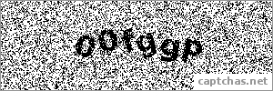
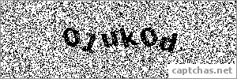
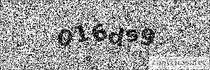

# CAPTCHA RECOGNITION
### `Back-End and ML parts`
- - -
Prepared by _Maksym Oliinyk_ and _Nazarii Hovdysh_
- - -
### Description
The Noisy CAPTCHA Recognition project aims to develop an automated system capable of accuratly recognizing noisy CAPTCHA (Completely Automated Public Turing test to tell Computers and Humans Apart) images. The **dataset** you can see at the following link: [click here](https://www.kaggle.com/datasets/surenbobby/captchas-net).
- - -
### Project structure
Here you can find a short description of main directories and it's content.

- _app_ - contains an API service and functionality for uploading pre-trained model weights
- _data_ - in this directory you can see 10 different samples
- _models_ - contains 4 types of models and _CTC layer_
- _storage_ - used for temporary image storing
- _tests_ - contains different API tests
- _utils_ - this directory contains files responsible for configuration
- _weights_ - there are weights of 4 pretrained models
- - -
### Main technologies
|Technology      |Version|
|----------------|-------|
|Python          |3.8.10 |
|TensorFlow (CPU)|2.12.0 |
|Keras           |2.12.0 |
|Flask           |2.3.2  |
|PyTest          |7.3.1  |

**Note:** We use TensorFlow (CPU) as it takes much less memory while deploying application on _Heroku_ platform.
- - -
### Indicators of trained models
Below you can see a table with the training results of all models:
|Model type      |WER, %|CER, %|Accuracy, %|
|----------------|------|------|-----------|
|1 layer LSTM    |0.78  |2.53  |95         |
|2 layers LSTM   |0.92  |5.15  |94         |
|1 layer BiLSTM  |6.55  |18.1  |88         |
|2 layers BiLSTM |0.24  |1.41  |98         |

As a result, we see that a model with 2 layers BiLSTM has the highest accuracy.
- - -
### Launch project
**Prerequisites:**

Firstly, you need clone the repository with the command:
```sh
git clone https://github.com/Maksym637/ml-web-api.git
```
After that move to the cloned repository folder.
- #### Do it locally
1. Create virtual environment:
```sh
python -m venv venv
```
2. Activate it:
```sh
venv\Scripts\activate.bat
```
3. Install all required libraries:
```sh
pip install -r requirements.txt
```
4. We're almost here ! Now run appication:
```sh
python run.py
```
The Back-End will start on [http://localhost:5000](http://localhost:5000). 

To interact with the application, you need also run the Front-End part. Here you can see instruction how to run it [ml-web-app](https://github.com/EyR1oN/ml-web-app).
- #### Do it with Docker
With Docker it will be much easeier. Simply run the following command:
```sh
docker-compose up app
```
- #### Run tests
To run the tesst, use the command:
```sh
pytest tests
```
You can also do it with Docker:
```sh
docker-compose up tests
```
- - -
### Program work
The application works as follows:

- Firstly, you specify the model type

- After that, upload specific image (noisy CAPTCHA)

**input1:**



- The result is image recognition:

**output1:** `00fggp`

**input2:**



**output2**: `01uk0d`

**input3:**



**output3:** `016ds9`
- - -